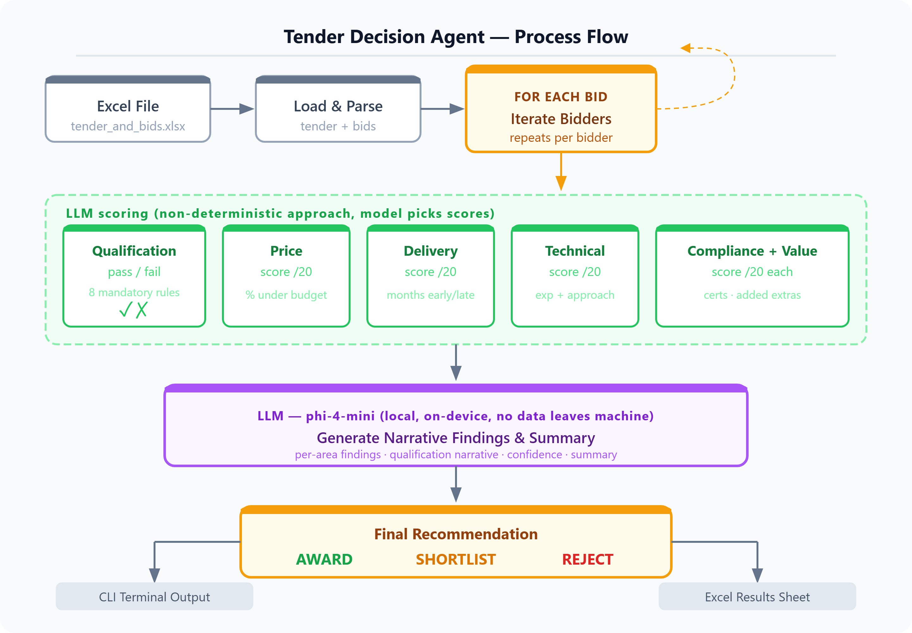

# Tender Decision Agent

A local AI agent that evaluates procurement bids against a tender document and produces scored, reasoned recommendations — entirely on-device using Microsoft Foundry Local.



---

## How It Works

The agent uses a simple approach: **LLM Prompt handles all scoring logic** (model picks scores), and a **local LLM writes the narrative findings** (qualification summary, per-area findings, overall summary). This separation means scores are always accurate and consistent, while the output still reads like a human analyst wrote it.

```
Excel file (tender + bids)
        │
        ▼
  Load tender & bids
        │
        ├──► LLM (phi-4-mini): qualification check  (pass/fail per bid rule)
        ├──► LLM (phi-4-mini): price score          (lookup table)
        ├──► LLM (phi-4-mini): delivery score       (lookup table)
        ├──► LLM (phi-4-mini): technical score      (experience ratio + approach)
        ├──► LLM (phi-4-mini): compliance score     (cert matching)
        ├──► LLM (phi-4-mini): added value score    (keyword matching)
        │
        └──► LLM (phi-4-mini): narrative findings + summary
                │
                ▼
        CLI output  +  Results written to Excel
```

---

## Project Structure

```
tender-decision-agent/
├── main.py          # Entry point — loads Excel, runs evaluations, writes results
├── evaluator.py     # Core engine — scoring logic, LLM call, CLI display
├── prompt.py       # LLM prompt — edit this to change the narrative style
├── excel_io.py  
├── README.md
├── tender-decision-agent-architecture.png   
└── tender_and_bids.xlsx  # Input file — one tender sheet + one bids sheet
```

---

## Input Format

The agent reads from an Excel file with two sheets:

### `Tender` sheet — one row of tender requirements

| Column | Description |
|---|---|
| `tender_id` | Unique identifier |
| `budget` | Maximum budget (£) |
| `delivery_months` | Required delivery timeline |
| `evaluation_criteria` | Priority description (e.g. "Best overall value") |
| `min_annual_turnover` | Minimum bidder turnover (£) |
| `required_certifications` | Comma-separated list (e.g. `ISO9001, ISO27001`) |
| `min_years_experience` | Minimum years in relevant field |
| `min_public_liability` | Minimum public liability cover (£) |
| `min_past_contract_value` | Minimum value of largest past contract (£) |
| `min_employees` | Minimum headcount |

### `Bids` sheet — one row per bidder

| Column | Description |
|---|---|
| `bid_id` | Unique identifier |
| `company_name` | Bidder name |
| `bid_price` | Proposed contract price (£) |
| `proposed_delivery_months` | Proposed delivery timeline |
| `annual_turnover` | Bidder annual turnover (£) |
| `certifications` | Comma-separated list held |
| `years_experience` | Years of relevant experience |
| `public_liability_cover` | Public liability cover held (£) |
| `largest_past_contract` | Value of largest past contract (£) |
| `employee_count` | Current headcount |
| `technical_approach` | Free-text description of methodology |
| `added_value` | Free-text description of extras offered |
| `notes` | Any additional notes |

---

## Scoring

All five scores are calibrated in Prompt using fixed lookup tables. The LLM leverages the prompt rule to pick scores.

### Price (max 20)
| Condition | Score |
|---|---|
| Bid exceeds budget | 1 |
| Within 5% of budget | 9 |
| 5–30% under budget | 12 |
| 30%+ under budget | 19 |

### Delivery (max 20)
| Condition | Score |
|---|---|
| Over deadline | 1 |
| On time | 9 |
| 1 month early | 13 |
| 2 months early | 15 |
| 3+ months early | 18 |

### Technical (max 20)
| Condition | Score |
|---|---|
| Below minimum experience or no approach | 3 |
| Meets minimum, vague approach | 7 |
| Meets/slightly exceeds, clear approach | 11 |
| Exceeds minimum (<2×), detailed methodology | 15 |
| Far exceeds minimum (2×+), exceptional | 19 |

### Compliance (max 20)
| Condition | Score |
|---|---|
| Missing one or more required certs | 3 |
| Exactly the required certs | 11 |
| All required certs plus extras | 15 |

### Added Value (max 20)
| Condition | Score |
|---|---|
| Nothing mentioned | 2 |
| Minor items | 7 |
| Meaningful offer (support, training, warranty) | 12 |
| Significant, clearly described benefit | 17 |

**Total score** = sum of all five (max 100)

### Qualification

A bid is automatically **REJECTED** if any of the following are true, regardless of score:

- Bid price exceeds budget
- Proposed delivery exceeds required timeline
- Annual turnover below minimum
- Years experience below minimum
- Public liability cover below minimum
- Largest past contract below minimum
- Employee count below minimum
- Any required certification is missing

### Recommendation thresholds

| Recommendation score | Outcome |
|---|---|
| Failed qualification | `REJECT` |
| < 40 | `REJECT` |
| 40–74 | `SHORTLIST` |
| 75+ | `AWARD` |

---

## Setup

### Prerequisites

- Python 3.11+
- [Microsoft Foundry Local](https://github.com/microsoft/foundry-local) installed and running
- `phi-4-mini` model downloaded in Foundry Local

### Install dependencies

```bash
pip install openai foundry-local openpyxl
```

### Run

```bash
python main.py
```

You will be prompted for the path to your Excel file:

```
Enter Excel file path: ./tender_and_bids.xlsx
```

Results are written to a `Results` sheet in the same Excel file.

---

## Customisation

### Change scoring rules
Edit the scoring functions in `evaluator.py` — `_score_price`, `_score_delivery`, `_score_technical`, `_score_compliance`, `_score_added_value`. Each is a plain Python function with no LLM dependency.

### Change finding narrative style
Edit `prompt.py`. The prompt controls only the written findings and summary — it has no effect on scores.

### Change the model
Update `MODEL = "phi-4-mini"` in `evaluator.py` to any model available in your Foundry Local instance.

---

## Design Decisions

**Why phi-4-mini?**
It runs on CPU/GPU locally via Foundry Local, requires no API key, and handles short narrative generation well. The reasoning variant (`phi-4-mini-reasoning`) was tested but discarded — its chain-of-thought block loops uncontrollably on rule-lookup tasks.

**Why Foundry Local?**
All processing is on-device. No data leaves the machine — suitable for procurement workflows where bid data is commercially sensitive.
